&nbsp;&nbsp;

&nbsp;&nbsp;

---

## System Performance

&nbsp;

---

## Activity Flow

---

## DSA Heatmap

---

## Goals & Targets

---

## Recent Activity (Last 2 Days)

| # | Problem | Platform | Difficulty | Date |
|:---:|:---|:---:|:---:|:---:|
| 1 | [A. Coins](https://codeforces.com/problemset/problem/1814/A) | `Codeforces` | **800** | `16 Apr` |
| 2 | [Closest Equal Element Queries](https://leetcode.com/problems/closest-equal-element-queries/) | `LeetCode` | **Medium** | `16 Apr` |
| 3 | [Generate Parentheses](https://leetcode.com/problems/generate-parentheses/) | `LeetCode` | **Medium** | `16 Apr` |

---

`Last Sync : 16 Apr 2026 | 09:41 PM IST`
